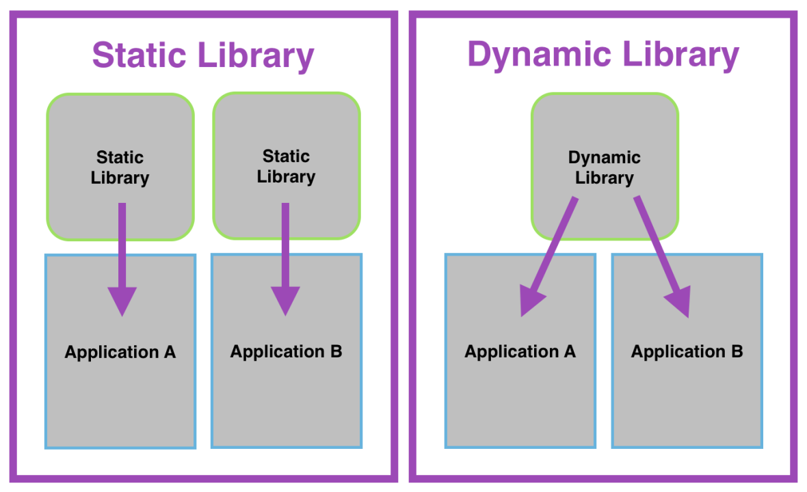

# QUY TRÌNH BIÊN DỊCH TỪ 1 FILE 1 C/C++ THÀNH 1 CHƯƠNG TRÌNH THỰC THI #


## 1. Tiền xử lý (Preprocessing) ## 
- Tiền xử lý là giai đoạn xử lý văn bản đầu tiên của quá trình biên dịch, thực hiện các thay đổi trước khi mã nguồn thực sự được biên dịch. Giai đoạn này sử dụng các chỉ thị tiền xử lý bắt đầu bằng dấu `#` để nhúng tệp, định nghĩa hằng số hoặc macro và các chỉ thị có điều kiện (ví dụ `#if`) để bao gồm hoặc loại trừ các phần mã nhất định. 
- Bộ tiền xử lý sẽ đọc mã nguồn C/C++ và thực hiện các lệnh tiền xử lý như `#include` (bao gồm các tệp header), `#define` (thay thế macro) và xóa bỏ các chú thích trong mã nguồn, `#if`,...
- Xuất ra fle dạng `.i` (code đã được macro và include)
```bash 
gcc -E main.c -o main.i 
```
- Đầu ra: Mã nguồn đã được làm sạch và mở rộng, sẵn sàng cho giai đoạn biên dịch tiếp theo

## 2.Biên dịch (Compilation) ## 
- Trình biên dịch sẽ nhận mã nguồn đã được tiền xử lý và phân tích cú pháp, kiểu dữ liệu để tìm lỗi
- File `.i` sẽ được dịch thành mã Assembly `.s` 
```bash
gcc -S main.c -o main.s
```
- Đầu ra: Mã Assembly, một dạng mã cấp thấp hơn mã nguồn, dễ hiểu đối với máy tính nhưng vẫn là ngôn ngữ lập trình dạng văn bản

## 3. Hợp dịch (Assembling) ##
- Trình hợp dịch (Assembler) sẽ dịch mã máy Assembly thành mã máy (machine code), là các chỉ thị nhị phân mà CPU có thể trực tiếp thực thi 
- Biến file `.s` thành object file `.o` (machine code)
```bash
gcc -c main.c -o main.o 
```
- Đẩu ra: Tệp đối tượng (object files) chứa mã máy và thông tin về các ký hiệu 

## 4. Liên kết (Linking) ## 
- Trình liên kết (linker) sẽ kết hợp tất cả các tệp đối tượng (`file.o`) đã tạo, các thư viện (cả thư viện tĩnh và động) mà chương trình bạn sử dụng, và giải quyết các tham chiếu giữa chúng 
- Liên kết nhiều `.o` và thư viện để tạo ra file thực thi `a.out` hoặc `.exe`
```bash
gcc main.o -o main
```
- Đầu ra: Một tệp thực thi (Executable file) hoặc thư viện (library file) cuối cùng, sẵn sàng để chạy trên hệ điều 
- Trên Windows dùng `.exe`, trên Linux thường là `a.out` hoặc file binary file

# THƯ VIỆN TRONG C/C++ #


## 1. THƯ VIỆN TĨNH (Static Library) ##
- Định dạng: `.a` trên Linux, `.lib` trên Windows
- Thời điểm liên kết: Liên kết tại compile-time (khi build chương trình) 
- Cách hoạt động: Code từ thư viện được copy trực tiếp vào file thực thi
- Kích thước file: Lớn (vì chứa luôn code của lib)
- Yêu cầu khi chạy: Không cần thư viện ngoài, chỉ cần `.exe` 
- Cập nhật thư viện: Muốn cập nhật -> Phải biên dịch lại toàn bộ chương trình 
- Tốc độ chạy: Thường nhanh hơn vì không cần load thêm từ bên ngoài 
- Phân phối phần mềm: Dễ phát hành (chỉ cần gửi file `.exe`)
- Ứng dụng: Phần mềm nhỏ, ít thay đổi, ưu tiên độc lập 

### Cách build ###
- Build thư viện tĩnh: 
```bash 
# Bien dich thanh object file 
gcc -c mylib.c -o mylib.o

# Tao thu vien tinh (tiền tố lib + ten_thu_vien)
ar rcs libmylib.a mylib.o
```
- Khi đó sẽ sinh ra 1 file `.o` và 1 file `.a`
- Sau khi build xong thư viện, nếu file build đó nằm cùng cấp với file `main.c` thì dùng lệnh sau để link:
```bash
gcc -Wall -I. main.c -L. -lmylib -o main
```

- Nếu file build đó nằm trong folder khác: 
```bash 
gcc -Wall -I../folder main.c -L../folder -lmylib -o main 
```
- Lệnh trên sẽ sinh ra luôn file thực thi `.exe` của chương trình sau khi đã liên kết với thư viện. Còn nếu muốn sinh file `.o` trước rồi mới sinh file thực thi để chi tiết, dễ hiểu hơn thì dùng lệnh `gcc -c main.c -o main.o` và quan trọng, để main.c thấy được thư viện thì cần phải thêm: 
```bash
# -Wall: Warining all - Hiển thị cảnh cáo nếu có (có thể thêm hoặc không)
# -I.: Chỉ thị để hướng trình biên dịch đến folder cần tìm
gcc -Wall -I../folder -c main.c -o main.o

# Linking main.o voi thu vien va tao tep thuc thi .exe
gcc main.o -L../folder -lmyLib -o main
```

### Ví dụ ### 
* Bạn build `libmath.a` chứa hàm `add()` 
* Khi build `main.exe`, hàm `add()` được copy vào file `main.exe` 
* `main.exe` có thể chạy độc lập, không cần `libmath.a` 

## 2. THƯ VIỆN ĐỘNG (Shared/Dynamic Library) ##
- Định dạng: `.so` trên Linux, `.dll` trên Windows (kèm `.lib` import)
- Thời điểm liên kết: Liên kết tại runtime (khi chạy chương trình)
- Cách hoạt động: File thực thi chỉ chứa tham chiếu, khi chạy phải nạp `.so`/`.dll`
- Kích thước file: Nhỏ (chỉ tham chiếu tới lib ngoài)
- Yêu cầu khi chạy: Cần có `.so`/`.dll` ở cùng thư mục hoặc trong path  
- Cập nhật thư viện: Chỉ cần thay thư viện `so`/`.dll`, không cần build lại exe
- Tốc độ chạy: Có thể chậm hơn 1 chút do phải load lib rúc runtime 
- Phân phối phần mềm: Khó hơn do phải gửi kèm lib hoặc yêu cầu cài đặt lib ngoài
- Ứng dụng: Hệ thống lớn, nhiều module dùng chung lib (OS, DB, Frameworks)

### Cách build ###
#### 1. Trên Linux (GCC) ####
```bash 
# Bien dich voi PIC (Position Independent Code) 
gcc -fPIC -c mylib.c -o mylib.

# Tao thu vien dong .so
gcc -shared -o libmylib.so mylib. 
```
- Kết quả sẽ sinh ra file `libmylib.so` 
- Để biên dịch & liên kết với chương trình chính `main.c`:
```bash
gcc main.c -L. -lmylib -o main
```
Chạy: 
```bash 
LD_LIBRARY_PATH=. ./main
```

#### 2. Trên Windows (với MinGW/UCRT) ####
- Khác với Linux `.so`, trên Windows thư viện động lại cần 1 cơ chế khai báo đặc biệt để quản lý việc xuất khẩu (export) và nhập khẩu (import) hàm khi dùng DLL
- Để làm việc này, ta dùng: 
    - `__declspec(dllexport)`: Để export hàm từ DLL 
    - `__declspec(dllimport)`: Để import hàm từ DLL
- Thực tế, thường chuyển cái này thành Macro cho tiện. Ví dụ trong file `mylib.h`:
```c
#ifdef BUILD_DLL
    #define API __declspec(dllexport)
#else
    #define API __declspec(dllimport)
#endif
```
- Trong `mylib.c` 
```c
#include "mylib.h"
#include <stdio.h>

API void hello() {
    printf("Hello from DLL!\n");
}
```
- Build DLL: 

```bash
# Cach 1
gcc -c DBUILD_DLL mylib.c -o mylib.o 
gcc -shared -o mylib.dll mylib.o -WL, --out-implib,libmylib.dll.a
```
- Lệnh trên sẽ làm 2 việc: 
    - `.c` -> Biên dịch thành file `.o` (chưa link) cho thư viện
    - `-shared` -> Link `.o` thành `.dll` và tạo import lib `.dll.a`

- Kết quả sinh ra 2 file: `mylib.dll` (file chạy) và `libmylib.dll.a`(import để linker chung)
- Có thể sử dụng lệnh rút gọn để vừa biên dịch `mylib.c` thành `.o`, vừa link ngay để xuất ra `.dll`:
```bash 
# Cach 2
gcc -DBUILD_DLL -shared -o mylib.dll mylib.c -Wl,--out-implib,libmylib.dll.a
```
> Khi có nhiều file source (`mylib1.c`, `mylib2.c`,...) hoặc khi muốn giữ lại `.o` để debug hoặc build nhiều thư viện khác nhau thì nên dùng cách build từng phần (cách 1)
> ```bash 
> gcc -c -DBUILD_DLL mylib1.c -o mylib1.o
> gcc -c -DBUILD_DLL mylib2.c -o mylib2.o
> gcc -shared -o mylib.dll mylib1.o mylib2.o -Wl,--out-implib,libmylib.dll.a
>```

- Để biên dịch & liên kết với chương trình chính `main.c`:
```bash 
gcc main.c -L. -lmylib -o main.exe 
```
- Đặt mylib.dll cùng thư mục main.exe hoặc trong %PATH%

### Ví dụ ### 
* Bạn build `libmath.a` chứa hàm `add()` 
* Khi build `main.exe`, file chỉ tham chiếu đến `libmath.so` 
* Khi chạy, hệ điều hành phải vừa tìm và nạp `libmath.so`. Nếu không có sẽ báo lỗi "library not found"

## 3. Điểm khác Linux - Windows ##
| Hệ điều hành | Static | Dynamic/Shared | 
|--------------|--------|----------------|
|Linux| `.a` | `.so` |
|Windows(MinGW/UCRT)| `.a` | `.dll` + `.dll.a` |
|Windows(MSVC)| `.lib` | `.dll` + `.lib` (import lib) |

***

# LƯU Ý KHI SỬ DỤNG FILE.h trong C/C++ # 
## 1. Sử dụng Header Guards ## 

### Mục đích ###
- Ngăn chặn việc các khai báo trong tệp header được đưa vào nhiều lần trong 1 tệp nguồn, gây ra lỗi biên dịch hoặc lỗi liên kết 

### Cách thực hiện ### 
- Thêm các thị tiền xử lý `#ifndef`, `#define`, `#endif` vào đầu và cuối tệp header
```c
#ifndef __MY_HEADER_H
#define __MY_HEADER_H

// Noi dung tep header (khai bao, dinh nghia)

#endif //__MY_HEADER_h
```

#### Giải thích #### 
- `#ifndef`: Kiểm tra xem macro __MY_HEADER_H có được định nghĩa trước đó chưa
- Nếu chưa định nghĩa thì phần mã trong `#ifndef` đến `#endif` sẽ được xử lý và macro header sẽ được định nghĩa
- Nếu đã được định nghĩa, các phần mã trong `#ifndef` đến `#endif` sẽ được bỏ qua 

## 2. Nội dung của tệp.h ##
- Chỉ chứa các khai báo: 
    - *Khai báo hàm (Fucntion Prototypes)*: Chỉ cần khai báo tên, kiểu trả về và các tham số của hàm, không cần nội dung thực thi 
    - *Định nghĩa cấu trúc (Struct/Class)*: Khai báo cấu trúc dữ liệu, lớp, `typedef`, `struct`, `enum`,...
    - *Định nghĩa macro*: Các hằng số và định nghĩa macro sử dụng `#define` 
- Nên tránh: Không nên chứa các định nghĩa hàm thực tế (function implementations) trong tệp header vì điều này sẽ gây ra xung đột khi tệp header được `#include` nhiều lần